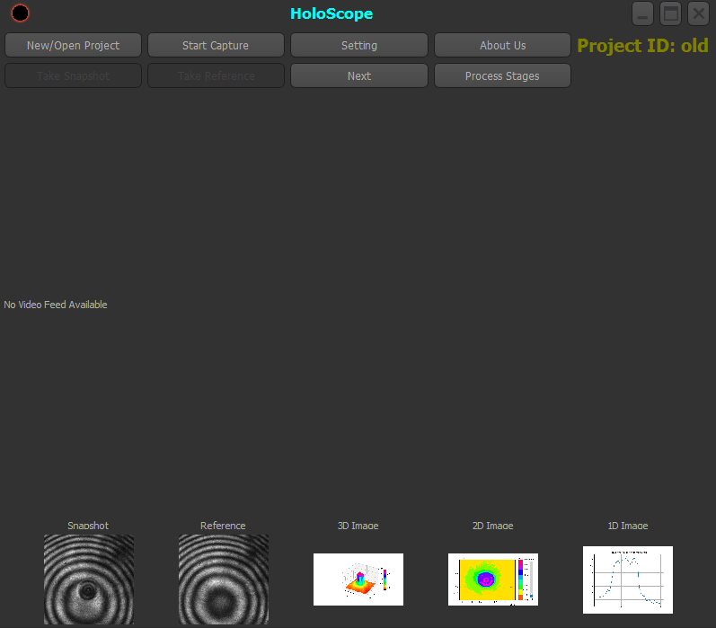

# 3D Microscopic Imaging using Mach-Zehnder Interferometry

## Overview
This application is designed to generate high-resolution 3D images of microscopic samples based on the **Mach-Zehnder interferometry** technique. It provides a complete workflow from image acquisition and Fourier analysis to 2D/3D reconstruction and 1D profile measurement.

## 🎥 Demo Video
Watch the demonstration video to see how the device and software work together:

## Application Interface

## Hardware Setup
Before running the software, ensure your optical setup is correctly configured:
1. Place your sample inside a Mach-Zehnder interferometer equipped with objectives in both arms.
2. Attach a **uc480 CCD camera** to one of the interferometer's output ports.
3. Turn on the laser. The objectives will focus the laser beam onto the sample, effectively trapping it in place (optical trapping) to prevent any movement during the imaging process.

## Image Acquisition Workflow
1. Click the **Start Capture** button to turn on the camera.
2. Click **Take Snapshot** to capture an image of your sample.
3. Manually move the sample to a blank area (containing only the background) and click **Take Reference** to capture the background image.

> **Note:** While the software allows you to capture an unlimited number of images, only two are required for 3D reconstruction: one sample image and one reference (background) image.

## Image Selection
1. In the bottom panel of the main window, click on the **Snapshot** section and select the best-captured sample image from your list.
2. Click on the **Reference** section and select the best background image.
3. Click the **Next** button to proceed to the processing stage.

## Data Processing (Fourier Analysis)
1. A new window will display the **Fourier Transform** of the snapshot. You will see three bright spots: the zero-order diffraction (in the center), and the **+1** and **-1** diffraction orders.
2. Since the 3D (depth/phase) information is encoded in the +1 or -1 orders, use your mouse to click and drag a bounding box around either the +1 or -1 diffraction spot.
3. A prompt will ask for confirmation. Click **Yes** to proceed or **No** to re-select the region.
4. Next, the **Inverse Fourier Transform** window will appear, revealing the physical shape of the sample.
5. Again, select the region of interest (the actual sample shape) and confirm with **Yes** (or click **No** to retry).

## 3D Reconstruction & Visualization
1. Upon confirmation, a **2D contour image** of the object will be displayed. In this view, the third dimension (height) is represented by color. You can adjust the color depth and colormap using the provided tools.
2. Closing this window opens a new one displaying the full **3D rendering** of the sample, where you can also customize the 3D plot coloring.
3. Closing this final window returns you to the main interface.

## Project Management & File Storage
You can start a new project or load a previous one using the **New/Open Project** button. 
* **Important:** When prompted to open a project, you must select a **folder**, not an individual file.
* All generated images and data are automatically saved directly within your selected project folder.

## 1D Profile Analysis
The bottom panel provides quick access to the generated 2D and 3D images. You can also measure the height (the third dimension) along a specific 1D path:
1. Click on the **1D Image** button.
2. In the newly opened 2D image window, left-click on two arbitrary points. The software will calculate and display the height profile along the path between these two points.
3. The 1D profile will be displayed in a new window. Here, you can manage your profiles using the buttons at the bottom of the window:
   * **New Profile**: Draw an additional profile on the same plot to compare them.
   * **Clear Old Data**: Remove the previous profile.
   * **Clear All Data**: Clear all plotted data.

## Main Window Utilities
* **Settings**: Opens a dialog to input essential parameters required for image processing.
* **Process Stages**: Allows you to view and monitor the entire processing pipeline.
* **Saving Plots**: In any window where a graph or plot is displayed, you can easily save the image using the built-in save options.

---

## Installation & Licensing

This software was custom-developed by **Dr. Shoaib Mirzaei** exclusively for **Event Horizon Meta-Pioneers** Company. 

To install and activate the software, please follow these steps:
1. Download the `.rar` file and extract it using WinRAR (or any standard archive manager).
2. Navigate to the extracted folder and run `Holoscope.exe`.
3. Upon the first run, an alert will appear on the screen displaying your system's **Machine ID**.
4. Send this Machine ID to the developer or the company. After completing the required payment, you will receive a license file.
5. Place the license file in the same folder as the application and re-run `Holoscope.exe` to activate the software.

---

## Credits & Contact

**Developer:** Dr. Shoaib Mirzaei  
**Email:** [shoaib_mi@yahoo.com](mailto:shoaib_mi@yahoo.com)

**Client:** Event Horizon Meta-Pioneers Co.  
**Email:** [ehp@outlook.com](mailto:ehp@outlook.com)
